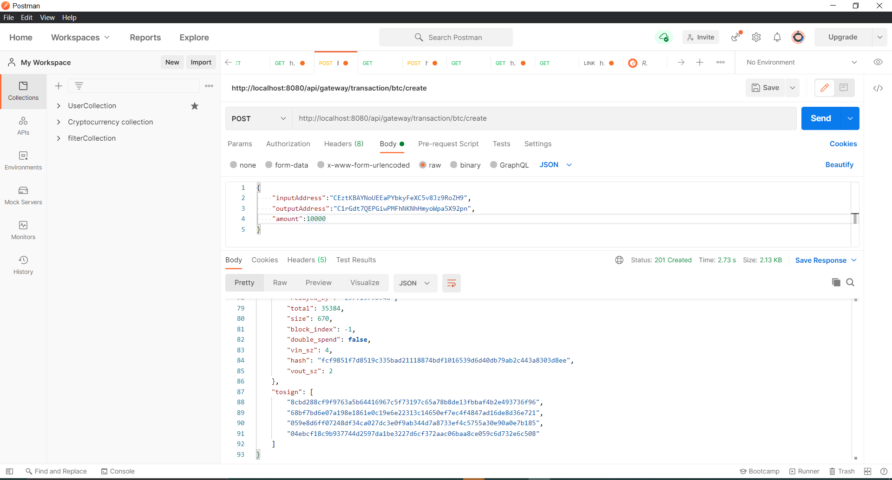

## BTC TX  GATEWAY API DOCS

### About the BTC GATEWAY

This BTC Gateway protocol is an API in charge of creating btc transactions between 2 wallet owners, 
input(sender) and output(receiver) wallets , sign and broadcast it to the Blockchain secure  network.

It is written in Spring boot for security and trustworthy reasons as spring boot is known as the hub of security when 
it comes to server side development.


### VISION

Our vision is to support crypto transactions for a quite number of cryptocurrencies including ethereum,litecoin,etc...


### API ENDPOINTS(supported)

* Create btc transaction: ```BASE_URL/api/gateway/btc/transaction/create```

* Sign btc transaction : ```BASE_URL/api/gateway/btc/transaction/sign```

* Push btc transaction : ```BASE_URL/api/gateway/btc/transaction/push```

* Decode btc transaction : ```BASE_URL/api/gateway/btc/transaction/decode```

* Witness btc transaction : ```BASE_URL/api/gateway/btc/transaction/witness```

* Propagate btc transaction : ```BASE_URL/api/gateway/btc/transaction/propagate```


### REQUEST BODY(supported)

* Create btc __transaction__ **body**: ```{
      inputAddress:'',
      outputAddress:'',
      amount:10000,
  }```

* Sign btc __transaction__ **body**:``` {
      transaction:'',
      toSign:'',
      signatures:'',
      pubkeys:'',
  }```
  
*  ``` E.g transaction: 01000000025ff77c38a1b07ec6a09eee200f5b6f8df98f601d6ec9922cd36b6baf834380ed010000001976a9141944c4c00c133e1fa33c29d8800c3b4ed0d2c56188acffffffff54e1e83f65d2f69865bb787e79da26246bb4c42effec4892a57aecaf029682420100000000ffffffff02102700000000000017a91473d32ac9e4330a071ee1b3a9ccf3997bdd4174d08797291300000000001976a9141944c4c00c133e1fa33c29d8800c3b4ed0d2c56188ac0000000001000000```
   
* Decode btc __transaction__ **body**:``` {
  transaction:'',
      }```
* Push btc __transaction__ **body**:``` {
  transaction:'',
      }```
* Witness btc __transaction__ **body**:``` {
  transaction:'',
      }``` 
* Propagate btc __transaction__ **body**:``` {
  transaction:'',
      }``` 





### RESPONSE STATUS CODES

* Successful request: 200
* Forbidden data: 403
* Unauthorized request: 401
* Bad request: 400

### APPLICATION FOLDER STRUCTURE
```
> constants
    . StatusCodes.java
> controllers
    . BtcTransaction.java
> modals
    . TransactionsModal.java
> services
    . BtcTransactionService.java
> utils
    > encryption
        . HashData.java
    > validators
        . BtcTransactionInputsValidator.java
```

### ARTICLE

The article is coming soon !


